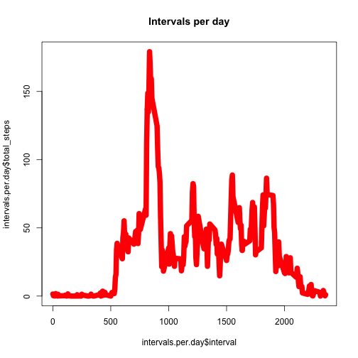
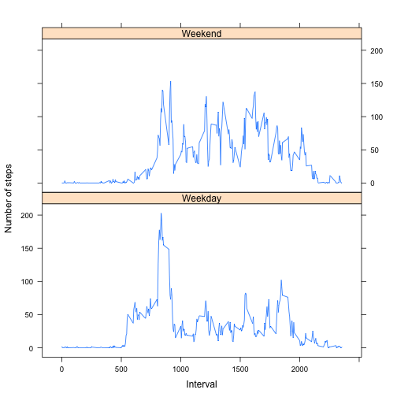

See [https://class.coursera.org/repdata-014/human_grading/view/courses/973515/assessments/3/submissions] for a description of the assignment.

## Loading and preprocessing the data

The dataset we are analysing contains the measurements of a activity monitoring device.
The variables included in this dataset are:
- steps: Number of steps taking in a 5-minute interval (missing values are coded as NA)
- date: The date on which the measurement was taken in YYYY-MM-DD format
- interval: Identifier for the 5-minute interval in which measurement was taken

The dataset is stored in a comma-separated-value (CSV) file and there are a total of 17,568 observations in this dataset.


```r
library(dplyr)
activity <- read.csv('activity.csv')
activity$date <- as.Date(as.character(activity$date))
```

## What is mean total number of steps taken per day?

We can make a histogram of the total number of steps taken each day by adding all the steps for a specific day.

*Remark: the missing values in the dataset are ignored*


```r
steps.per.day <- activity %>% 
  group_by(date) %>% 
  summarise(total_steps = sum(steps, na.rm = TRUE))
steps.per.day
```

```
## Source: local data frame [61 x 2]
## 
##          date total_steps
## 1  2012-10-01           0
## 2  2012-10-02         126
## 3  2012-10-03       11352
## 4  2012-10-04       12116
## 5  2012-10-05       13294
## 6  2012-10-06       15420
## 7  2012-10-07       11015
## 8  2012-10-08           0
## 9  2012-10-09       12811
## 10 2012-10-10        9900
## ..        ...         ...
```

```r
plot.new()
hist(steps.per.day$total_steps, main = 'Histogram of total steps')
```

 

The mean of the total steps per day is:

```r
mean(steps.per.day$total_steps, na.rm = TRUE)
```

```
## [1] 9354.23
```

The median of the total steps per day is:

```r
median(steps.per.day$total_steps, na.rm = TRUE)
```

```
## [1] 10395
```

## What is the average daily activity pattern?

The time series of the 5-minute interval and the average number of steps taken, averaged across all days can be plotted as follows:


```r
intervals.per.day <- activity %>%
  group_by(interval) %>%
  summarise(total_steps = sum(steps, na.rm = TRUE) / nrow(steps.per.day))
plot(intervals.per.day$interval, intervals.per.day$total_steps, type = "l", col = "red", lwd = 10,
     main = "Intervals per day")
```

 

The 5-minute interval that, on average across all the days in the dataset, contains the maximum number of steps is:

```r
intervals.per.day$interval[max(intervals.per.day$total_steps)]
```

```
## [1] 1450
```


## Imputing missing values

The following table shows the number of complete observations (TRUE) versus the total number of missing values in the dataset (FALSE):


```
## 
## FALSE  TRUE 
## 15264  2304
```

We can replace these missing values with 0, as though no steps were taken in the interval:


Making the histogram again:

```
## Source: local data frame [61 x 2]
## 
##          date total_steps
## 1  2012-10-01           0
## 2  2012-10-02         126
## 3  2012-10-03       11352
## 4  2012-10-04       12116
## 5  2012-10-05       13294
## 6  2012-10-06       15420
## 7  2012-10-07       11015
## 8  2012-10-08           0
## 9  2012-10-09       12811
## 10 2012-10-10        9900
## ..        ...         ...
```

 

The mean of the total steps per day is:

```r
mean(steps.per.day$total_steps, na.rm = TRUE)
```

```
## [1] 9354.23
```

The median of the total steps per day is:

```r
median(steps.per.day$total_steps, na.rm = TRUE)
```

```
## [1] 10395
```


## Are there differences in activity patterns between weekdays and weekends?

We add a new factor variable in the dataset with two levels – “weekday” and “weekend” indicating whether a given date is a weekday or weekend day.


```r
activity$wknd <- as.factor(ifelse(weekdays( activity$date) %in% c("zaterdag","zondag"), "Weekend", "Weekday"))
steps.weekday.wknd <- activity %>% 
  group_by(wknd, interval) %>% 
  summarise(avg_steps = mean(steps, na.rm = TRUE))
library(lattice)
attach(steps.weekday.wknd)
xyplot(avg_steps ~ interval| wknd, 
           data = steps.weekday.wknd,
           type = "l",
           xlab = "Interval",
           ylab = "Number of steps",
           layout=c(1,2))
```

 

We can see clearly that in the weekend the steps start later. Very recognisable!
